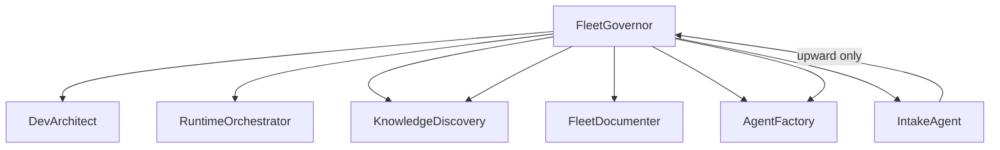
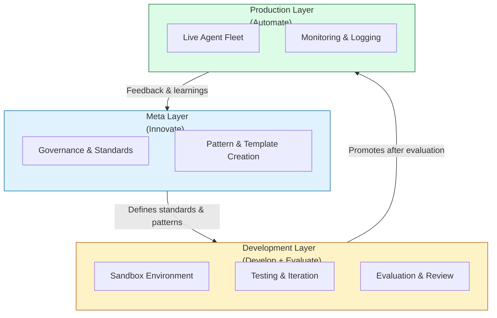

# Event-Horizon Architecture

This document describes the core architectural model used in Event-Horizon IDEA.

## Overview

Event-Horizon uses a **layered architecture** designed to separate concerns between strategy, development, and operations. This structure supports both rapid experimentation and long-term governance of multi-agent AI systems.

The architecture is built around three primary layers:

- **Meta Layer** — Governance, standards, and innovation
- **Development Layer** — Building, testing, and iteration
- **Production Layer** — Live operation and automation

These layers work together through the **IDEA** cycle (Innovate → Develop → Evaluate → Automate).

## Layer Descriptions

### 1. Meta Layer (Innovate)

The Meta Layer focuses on high-level strategy, governance, and the creation of reusable patterns.

**Responsibilities:**
- Define standards, schemas, and agent templates
- Establish governance rules and evaluation criteria
- Create new agent patterns and orchestration strategies
- Maintain the overall vision and principles of the system

This layer acts as the **brain** of the framework — it decides *what* should be built and *how* it should be governed.

### 2. Development Layer (Develop + Evaluate)

The Development Layer is where agents are built, tested, and refined.

**Responsibilities:**
- Rapid prototyping and experimentation
- Integration testing between agents
- Evaluation of agent behavior and output quality
- Refinement of prompts, tools, and handoff logic

This layer serves as a **controlled sandbox**. Agents and workflows should reach a level of maturity here before being promoted.

### 3. Production Layer (Automate)

The Production Layer contains agents that have been evaluated and approved for operational use.

**Responsibilities:**
- Running stable, governed agents
- Handling real work with appropriate monitoring
- Maintaining clear handoff contracts between agents
- Logging and traceability for auditability

Promotion from the Development Layer to Production should follow defined evaluation gates.

## Repository Layer Mapping

Event-Horizon's three architectural layers map to separate repositories in mature deployments:

| Layer | Repository role | Contents |
|-------|-----------------|----------|
| **Meta** | Governance control plane | Governor, agent factory, standards, eval rubrics |
| **Development** | Staging / sandbox | Experimental agents, skills, routing drafts |
| **Production** | Live runtime catalog | Approved agents, handoff contracts, automation docs |

Promotion flows Meta → Development → Production. For an implementable fleet OS with schemas and role archetypes, see [agent-fleet-os](https://github.com/hermansmpjr/agent-fleet-os).

## Key Architectural Concepts

### Orchestrator Variants

Not all orchestrators serve the same purpose. Distinguish between:

| Variant | Layer | Role |
|---------|-------|------|
| **Fleet Governor** | Meta | Strategic oversight, promotion authority, long-horizon fleet evolution |
| **Runtime Orchestrator** | Production | Day-to-day work routing, RFQ/workflow coordination |
| **Intake Agent** | Meta or Dev | User-facing, low-authority; converts plain requests into upward handoff packets |

**Peer agents** sit at the same level under a governor (e.g., architect, runtime orchestrator, discovery, documenter). Do not assume parent-child chains from configuration exports alone — verify in the live runtime graph.

### Orchestrator Pattern

A central orchestrator agent is responsible for:
- Receiving incoming work
- Routing tasks to appropriate specialist agents
- Managing handoffs and state
- Ensuring governance rules are followed

Specialist agents focus on narrow, well-defined responsibilities.

### Skills vs Connected Children

Platform exports often list "child agents" that are actually **internal skill topics** attached to a parent agent, not separate connected agents in the runtime graph.

**Rule:** Before documenting parent-child relationships, verify against the live runtime component graph. Mark any relationship inferred from exports only as **Needs validation**.

Internal skills return structured result blocks (e.g., `ChildResult` with status, confidence, and export-safety flags) that the parent integrates — they do not communicate with end users directly.

### Intake Pattern

A user-facing intake agent:
- Accepts plain-language requests from users
- Produces a single structured handoff packet
- Submits **upward to the fleet governor only** — never bypasses governance by calling factory, discovery, or other meta agents directly
- Blocks packet emission if a self-test checklist fails

See [templates/intake-handoff.md](templates/intake-handoff.md).

### Handoff Contracts

Clear contracts between agents are essential. Each handoff packet must include:

| Field | Required |
|-------|----------|
| `SelectedAgent` | Yes |
| `Confidence` | Yes |
| `Reason` | Yes |
| `RequiredInputsMissing` | Yes (empty list OK, never omit) |
| `InputsReceived` | Yes |
| `ExecutionConstraints` | Yes |
| `RequestedDeliverable` | Yes |
| `PayloadForChildAgent` | Yes |
| `ExpectedReturnContract` | Yes |
| `SuggestedNextRoute` | Optional |
| `Mode` | Optional (fast / deep / export / debug / selftest) |

**Routing rules:** Parent owns final synthesis. Children do not address end users. One child per request unless phased work is explicitly requested.

See [templates/handoff-contract.md](templates/handoff-contract.md).

### Evidence-Based Approach

Agents should produce outputs that include:
- Reasoning or justification where appropriate
- Confidence levels (when relevant)
- References to source material or previous steps

This supports evaluation and governance.

### Hybrid Model Routing

Different tasks may benefit from different models. The architecture supports routing work to the most appropriate model based on:
- Task complexity
- Required reasoning depth
- Cost and latency considerations
- Governance requirements

## Verified Topology Pattern

In mature fleets, the live runtime graph (not export YAML) is the source of truth for agent relationships:



Peers under the governor coordinate through structured handoff packets. Internal skills within a runtime orchestrator are not separate nodes in this graph.

## Visual Architecture



## Relationship to the IDEA Cycle

| IDEA Phase   | Primary Layer     | Key Activities                          |
|--------------|-------------------|-----------------------------------------|
| **Innovate**     | Meta              | Create new patterns, update standards   |
| **Develop**      | Development       | Build, test, and iterate agents         |
| **Evaluate**     | Development + Meta| Review outputs, assess quality & risk   |
| **Automate**     | Production        | Deploy, monitor, and operate agents     |
```