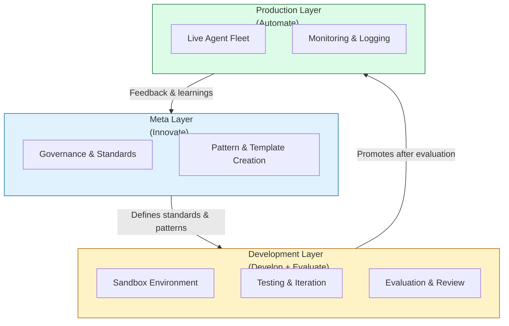

# Event-Horizon Architecture

This document describes the core architectural model used in Event-Horizon IDEA.

## Overview

Event-Horizon uses a **layered architecture** designed to separate concerns between strategy, development, and operations. This structure supports both rapid experimentation and long-term governance of multi-agent AI systems.

The architecture is built around three primary layers:

- **Meta Layer** — Governance, standards, and innovation
- **Development Layer** — Building, testing, and iteration
- **Production Layer** — Live operation and automation

These layers work together through the **IDEA** cycle (Innovate → Develop → Evaluate → Automate).

## Layer Descriptions

### 1. Meta Layer (Innovate)

The Meta Layer focuses on high-level strategy, governance, and the creation of reusable patterns.

**Responsibilities:**
- Define standards, schemas, and agent templates
- Establish governance rules and evaluation criteria
- Create new agent patterns and orchestration strategies
- Maintain the overall vision and principles of the system

This layer acts as the **brain** of the framework — it decides *what* should be built and *how* it should be governed.

### 2. Development Layer (Develop + Evaluate)

The Development Layer is where agents are built, tested, and refined.

**Responsibilities:**
- Rapid prototyping and experimentation
- Integration testing between agents
- Evaluation of agent behavior and output quality
- Refinement of prompts, tools, and handoff logic

This layer serves as a **controlled sandbox**. Agents and workflows should reach a level of maturity here before being promoted.

### 3. Production Layer (Automate)

The Production Layer contains agents that have been evaluated and approved for operational use.

**Responsibilities:**
- Running stable, governed agents
- Handling real work with appropriate monitoring
- Maintaining clear handoff contracts between agents
- Logging and traceability for auditability

Promotion from the Development Layer to Production should follow defined evaluation gates.

## Key Architectural Concepts

### Orchestrator Pattern

A central orchestrator agent is responsible for:
- Receiving incoming work
- Routing tasks to appropriate specialist agents
- Managing handoffs and state
- Ensuring governance rules are followed

Specialist agents focus on narrow, well-defined responsibilities.

### Handoff Contracts

Clear contracts between agents are essential. Each handoff should define:
- Input requirements
- Expected output format
- Success criteria
- Responsibility boundaries

This reduces ambiguity and improves debuggability.

### Evidence-Based Approach

Agents should produce outputs that include:
- Reasoning or justification where appropriate
- Confidence levels (when relevant)
- References to source material or previous steps

This supports evaluation and governance.

### Hybrid Model Routing

Different tasks may benefit from different models. The architecture supports routing work to the most appropriate model based on:
- Task complexity
- Required reasoning depth
- Cost and latency considerations
- Governance requirements

## Visual Architecture



## Relationship to the IDEA Cycle

| IDEA Phase   | Primary Layer     | Key Activities                          |
|--------------|-------------------|-----------------------------------------|
| **Innovate**     | Meta              | Create new patterns, update standards   |
| **Develop**      | Development       | Build, test, and iterate agents         |
| **Evaluate**     | Development + Meta| Review outputs, assess quality & risk   |
| **Automate**     | Production        | Deploy, monitor, and operate agents     |
```