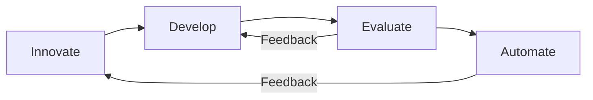

# The IDEA Cycle

**IDEA** is the core operating framework of Event-Horizon.

It provides a repeatable structure for building and evolving AI agent systems:

- **I**nnovate
- **D**evelop
- **E**valuate
- **A**utomate

The goal of IDEA is to bring discipline and clarity to the process of creating multi-agent systems, moving from initial ideas to reliable, governed production agents.

## Why IDEA Exists

Many agent projects start with experimentation and then struggle to scale or maintain quality over time. IDEA introduces a structured cycle that helps balance:

- Speed of innovation
- Quality and governance
- Long-term maintainability

It draws from software engineering principles while being adapted specifically for AI agent development.

## The Four Phases

### 1. Innovate

**Purpose:** Explore new ideas, capabilities, and patterns.

**Key Activities:**
- Identify opportunities for new agents or improved workflows
- Design new agent roles, prompts, and orchestration patterns
- Define standards, schemas, and templates
- Experiment with new techniques or model capabilities

**Output Examples:**
- New agent templates
- Updated standards or guidelines
- Novel orchestration or routing ideas

This phase is primarily owned by the **Meta Layer**.

### 2. Develop

**Purpose:** Build and test agents in a controlled environment.

**Key Activities:**
- Implement agents based on ideas from the Innovate phase
- Create and test prompts, tools, and integrations
- Develop handoff contracts between agents
- Iterate based on initial testing

**Output Examples:**
- Working agent definitions
- Tested prompts and workflows
- Initial documentation

This phase takes place mainly in the **Development Layer**.

### 3. Evaluate

**Purpose:** Assess quality, risk, and readiness.

**Key Activities:**
- Review agent outputs for accuracy, consistency, and compliance
- Test edge cases and failure modes
- Evaluate against defined criteria (quality, cost, latency, governance)
- Decide whether to iterate, redesign, or promote

**Output Examples:**
- Evaluation reports or summaries
- Go / No-Go decisions
- Improvement recommendations

Evaluation happens primarily in the **Development Layer**, with oversight from the **Meta Layer**.

### 4. Automate

**Purpose:** Operationalize agents and integrate them into real workflows.

**Key Activities:**
- Promote agents from development to production
- Set up monitoring and logging
- Establish ongoing governance and maintenance processes
- Document usage and handoff procedures

**Output Examples:**
- Live production agents
- Monitoring and alerting setup
- Operational documentation

This phase is executed in the **Production Layer**.

## The Continuous Cycle

IDEA is not strictly linear. Feedback from later phases should flow back to earlier ones:

- Production issues can trigger new **Innovate** work
- Evaluation findings often lead back to **Develop**
- Successful automation can reveal new opportunities for **Innovation**

## Applying IDEA

IDEA can be applied at different scales:

- **Individual agents** — Designing and maturing a single specialist agent
- **Agent workflows** — Building orchestrated multi-agent processes
- **Full agent fleets** — Governing an entire collection of agents over time

The same principles of innovation, development, evaluation, and automation apply regardless of scope.

## Relationship to Architecture

| IDEA Phase   | Primary Architectural Layer | Focus                              |
|--------------|-----------------------------|------------------------------------|
| **Innovate**     | Meta Layer                  | Strategy, standards, new patterns  |
| **Develop**      | Development Layer           | Building, testing, iteration       |
| **Evaluate**     | Development + Meta          | Quality, risk, and readiness       |
| **Automate**     | Production Layer            | Operations and reliability         |

---

The IDEA cycle is intentionally simple but powerful when applied consistently.