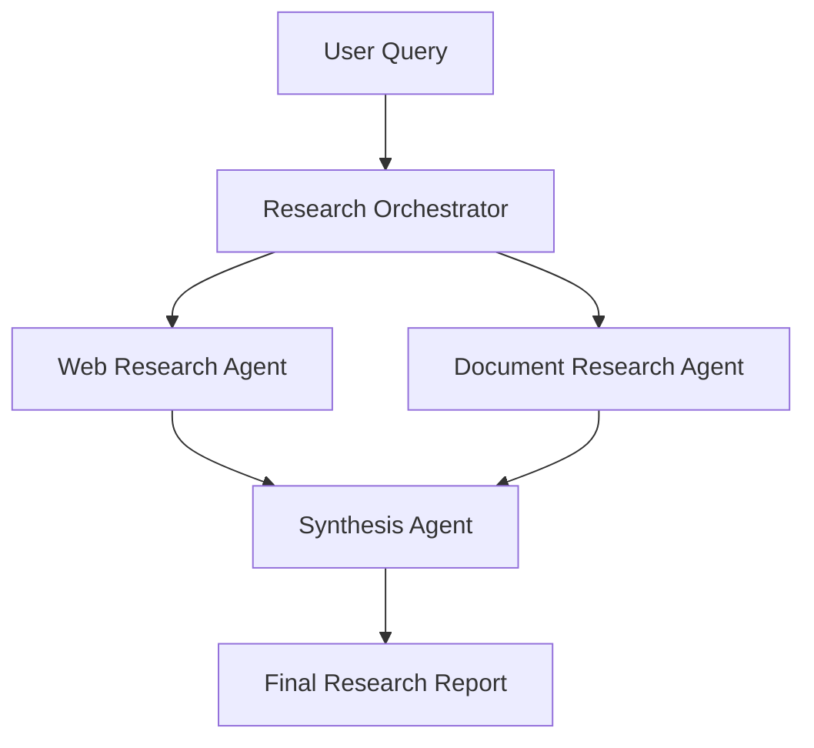

# Research & Synthesis Workflow Example

This example demonstrates a multi-agent workflow for conducting research on a topic and synthesizing the findings into a coherent report. It showcases the use of an orchestrator, specialist agents, and structured handoffs using the Event-Horizon IDEA framework.

## Overview

**Goal:** Given a research question, the system should:
1. Break down the question into research tasks
2. Gather information from multiple sources using specialist agents
3. Synthesize the findings into a well-structured, evidence-based report

This example illustrates:
- Use of an **orchestrator** pattern
- Clear **handoff contracts** between agents
- Separation of **research** and **synthesis** responsibilities
- Application of the **IDEA** cycle

## Workflow Architecture

### Agents Involved

| Agent                    | Role                                      | Type          |
|--------------------------|-------------------------------------------|---------------|
| **Research Orchestrator**    | Coordinates research tasks and manages workflow | Orchestrator  |
| **Web Research Agent**       | Gathers information from web/public sources   | Specialist    |
| **Document Research Agent**  | Extracts and analyzes information from documents | Specialist |
| **Synthesis Agent**          | Combines research findings into a coherent report | Specialist |

## How It Follows the IDEA Cycle

| Phase       | Application in This Example                          |
|-------------|------------------------------------------------------|
| **Innovate**    | Designing the research workflow and agent roles      |
| **Develop**     | Building prompts, handoff contracts, and testing     |
| **Evaluate**    | Reviewing research quality and synthesis accuracy    |
| **Automate**    | Running the workflow in production environments      |

## Key Design Decisions

- **Separation of Research and Synthesis**: Research agents focus on gathering information. The Synthesis Agent focuses on analysis and coherence.
- **Orchestrator as Coordinator**: The orchestrator does not perform research itself — it manages scope, routing, and quality gates.
- **Explicit Handoff Contracts**: Every transfer of information between agents follows a defined contract (see `handoff-contracts/` folder).

## Files in This Example

- `architecture.md` — Detailed workflow diagram and explanation
- `agents/` — Agent definitions using the standard templates
- `handoff-contracts/` — Contracts defining inputs/outputs between agents

## How to Use This Example

1. Review the agent definitions in the `agents/` folder.
2. Study the handoff contracts to understand information flow.
3. Adapt the prompts and contracts to your specific use case.
4. Evaluate the workflow using the [Evaluation Criteria Template](../../templates/evaluation-criteria.md).

## Limitations of This Example

- This is a **generalized conceptual example**, not production-ready code.
- Actual implementation would require connecting agents to real tools (web search, document parsing, etc.).
- Prompt examples are illustrative rather than optimized.

---

This example is intended to help you understand how to apply the Event-Horizon framework to a realistic multi-agent use case.