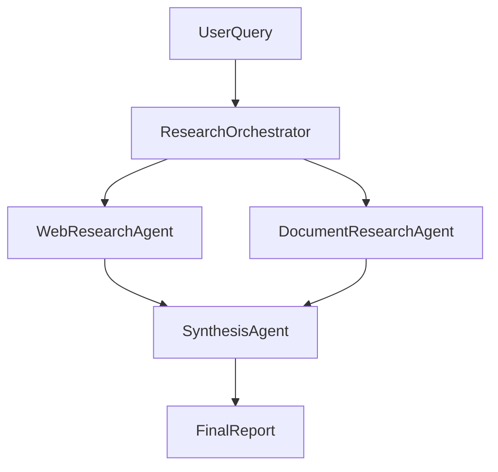

# Research & Synthesis Workflow — Architecture

> Stub architecture doc for the [research-synthesis-workflow example](README.md).

## Topology

## Layer Placement

| Agent | Layer | Type |
|-------|-------|------|
| Research Orchestrator | Development | Runtime orchestrator |
| Web Research Agent | Development | Specialist |
| Document Research Agent | Development | Specialist |
| Synthesis Agent | Development | Specialist |

## Handoff Flow

1. Orchestrator receives user query → routes to research agents via [handoff contracts](handoff-contracts/web-to-synthesis.md)
2. Research agents return evidence-backed findings
3. Orchestrator routes findings to Synthesis Agent
4. Synthesis Agent produces final report with provenance

## Governance Notes

- Research agents mark unverified claims as **Needs validation**
- Synthesis agent does not invent sources — only combines provided evidence
- Evaluation uses governance-adjusted scoring before promotion to production

See [../../docs/governance.md](../../docs/governance.md) for full governance model.