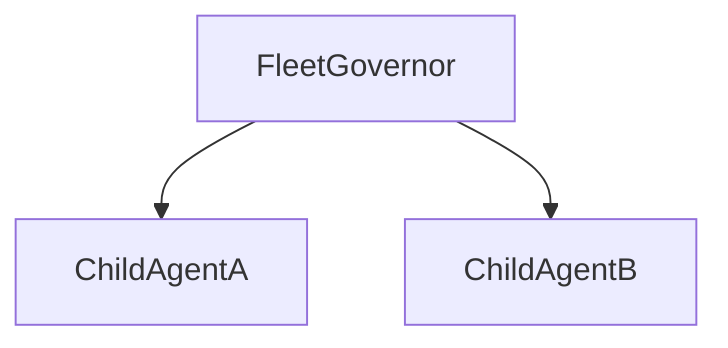

# Agent Registry Template

Use this template to maintain a canonical record of fleet agent identities, environment context, and verified topology. Update after every promotion or agent creation.

**documentationId:** `DOC-GOV-AGENT-REGISTRY-v1.0-[YYYYMMDD]`

---

## Environment

| Field | Value |
|-------|-------|
| Environment name | [Name] |
| Environment ID | [GUID] |
| Platform host | [URL] |
| Tenant ID | [GUID] |

**How to find agent IDs:** Platform Settings → Advanced → Metadata, or the runtime `bot` / agent table. Evaluation APIs require the canonical bot ID, not the display name.

## Governed Agents

| Agent | Bot ID (GUID) | Schema name | Eval test set ID | Test cases |
|-------|---------------|-------------|------------------|------------|
| [Agent 1] | [GUID] | [schema] | [GUID] | [count] |
| [Agent 2] | [GUID] | [schema] | [GUID] | [count] |

## Runtime Agents (non-governed)

| Agent | Bot ID (GUID) | Schema name | Layer |
|-------|---------------|-------------|-------|
| [Agent 1] | [GUID] | [schema] | Development / Production |

## Verified Topology

Document parent-child edges confirmed in the **live runtime graph**:

| Edge | Status |
|------|--------|
| [Governor] → [Child A] | Exists / Does NOT exist / Needs validation |
| [Governor] → [Child B] | Exists / Does NOT exist / Needs validation |

**Note:** Do not infer edges from configuration exports alone.

## Evaluation Run Record

| Agent | Run ID | Cases | Raw pass | Raw fail | Governance-adjusted |
|-------|--------|-------|----------|----------|---------------------|
| [Agent 1] | [ID] | [n] | [n] | [n] | [notes] |

**Note:** Platform default metrics may score correct abstention as fail. Re-adjudicate using [governance-adjusted evaluation](../docs/governance.md#governance-adjusted-evaluation).

## Operational Notes

- [Deprecation notices for platform APIs]
- [Identity resolution procedures]
- [Re-verification schedule]

---

**Registry Owner:** [Name or role]  
**Last verified:** [Date]  
**Status:** [Draft / Active]